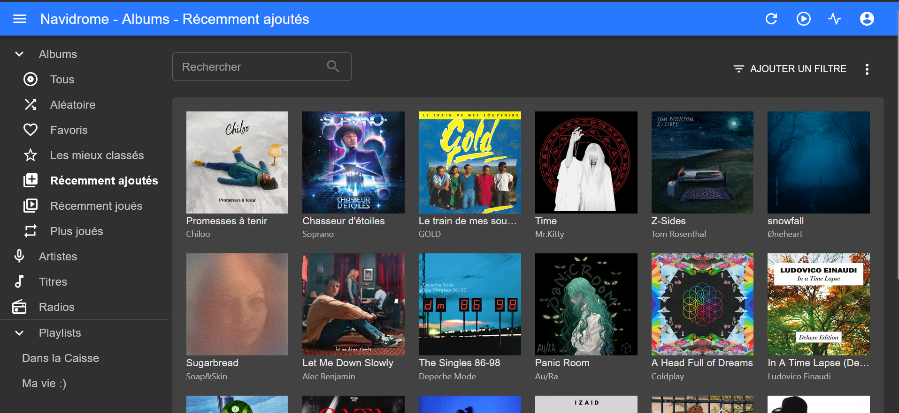

# Navidrome-by-nnonno
I created a Navidrome server for song streaming


# 🎵 Mon Serveur Navidrome

<p align="center">
  
</p>

<p align="center">
  <strong>Serveur de streaming musical auto-hébergé basé sur Navidrome</strong>
</p>

<p align="center">
  
  
  
</p>

---

## 📋 Présentation

Ce projet permet d'héberger une bibliothèque musicale personnelle accessible depuis n'importe quel appareil.

Fonctionnalités :

* Streaming audio via Navidrome
* Gestion des playlists
* Compatible Subsonic
* Applications mobiles Android et iOS
* Interface web moderne en passant par Feishin
* Accès distant sécurisé via reverse proxy (Pangolin)

---

## 📸 Captures d'écran

Ajoutez ici vos captures d'écran :



---

## 🚀 Quick Start

### Installation de docker 

Mettre à jour les paquets 

```bash
sudo apt update
sudo apt install -y ca-certificates curl gnupg
```


### Docker Compose

Créer un fichier `docker-compose.yml`

```yaml
services:
  navidrome:
    image: deluan/navidrome:latest
    container_name: navidrome

    ports:
      - "4533:4533"

    environment:
      ND_SCANSCHEDULE: 1h
      ND_LOGLEVEL: info

    volumes:
      - ./data:/data
      - /music:/music

    restart: unless-stopped
```

### Lancement

```bash
docker compose up -d
```

### Accès

```text
http://IP_DU_SERVEUR:4533
```

---

## ⚙️ Infrastructure

| Service   | Description            |
| --------- | ---------------------- |
| Proxmox   | Hyperviseur            |
| Debian 13 | Système d'exploitation |
| Docker    | Conteneurisation       |
| Navidrome | Serveur musical        |
| Pangolin  | Accès distant sécurisé |

---

## 📂 Structure des dossiers

```text
/opt/navidrome/
├── docker-compose.yml
├── data/
└── music/
```

---

## 🔒 Sécurité

* Reverse Proxy
* HTTPS
* Authentification Navidrome
* Accès distant sécurisé

---

## 🛠️ Maintenance

Mettre à jour le conteneur :

```bash
docker compose pull
docker compose up -d
```

Consulter les logs :

```bash
docker logs -f navidrome
```

---

## 📄 Licence

Projet personnel réalisé dans le cadre de l'auto-hébergement et de l'apprentissage de l'administration système.
